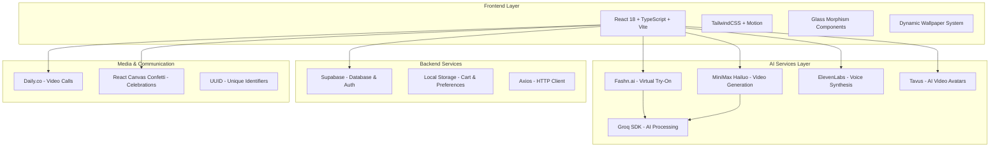

# Dripify Design Document

## Overview

Dripify is a cutting-edge AI-powered fashion shopping application built with React 18 and TypeScript. The application follows a modern component-based architecture with clear separation of concerns between presentation, business logic, and data management. The design emphasizes AI-driven interactions, premium visual experiences, and seamless shopping workflows.

The application is structured around four core pillars:

1. **AI-Powered Features**: Virtual try-on with Fashn.ai, video generation with MiniMax Hailuo, voice synthesis with ElevenLabs, and AI video avatars with Tavus
2. **Premium Visual Experience**: Glass morphism design with dynamic wallpaper system, smooth Motion animations, and responsive layouts
3. **Advanced Shopping Experience**: Real-time cart management, wishlist functionality, product search and filtering, and local storage persistence
4. **Interactive Media**: Video backgrounds, AI-generated videos from try-on results, and interactive video avatars for customer service

## Architecture

### High-Level Architecture



### Frontend Architecture

The frontend follows a layered architecture pattern:

**Presentation Layer**

- Glass morphism components with consistent backdrop blur styling
- Responsive layouts using TailwindCSS utility classes
- Motion (Framer Motion) animations for smooth transitions
- Dynamic wallpaper system with multiple background options
- Landing page with video backgrounds and smooth fade-ins

**Business Logic Layer**

- Custom React hooks for state management and data fetching
- Service layer for AI API interactions (Fashn.ai, MiniMax, ElevenLabs, Tavus)
- Context providers for global state (Shopping, Auth, User, Voice, Wallpaper)
- Real-time processing handlers for try-on and video generation

**Data Layer**

- Supabase client for backend database operations
- Axios for HTTP request management and API calls
- Local storage for cart, wishlist, and user preferences persistence
- Generated content management (try-on results, videos)

## Components and Interfaces

### Core Component Structure

```typescript
// Core component interfaces
interface WallpaperContextType {
  currentWallpaper: string;
  setWallpaper: (url: string) => void;
  wallpapers: Wallpaper[];
}

interface Wallpaper {
  id: string;
  name: string;
  url: string;
}

interface VoiceAssistantState {
  isActive: boolean;
  isListening: boolean;
  transcript: string;
  confidence: number;
}

interface GeneratedImage {
  id: string;
  url: string;
  productName: string;
  productId: string;
  productImage: string;
  createdAt: string;
  modelUsed: string;
  modelId: string;
}

interface GeneratedVideo {
  id: string;
  url: string;
  productName: string;
  productId: string;
  productImage: string;
  tryOnImage: string;
  createdAt: string;
  modelUsed: string;
  modelId: string;
  duration: number;
}
```

### Key Components

**1. Core Application Components**

- `App`: Main application wrapper with context providers
- `AppContent`: Core app content with routing logic
- `MainContent`: Central content router for different pages
- `LandingPage`: Full-screen landing with video backgrounds and glass morphism
- `BottomNav`: Navigation component with glass morphism styling

**2. Page Components**

- `HomePage`: Main dashboard with product recommendations
- `SearchPage`: Product search with filtering capabilities
- `CategoriesPage`: Category-based product browsing
- `CartPage`: Shopping cart management interface
- `WishlistPage`: Saved items management
- `ProfilePage`: User profile and settings management
- `PhotosPage`: Generated content gallery (try-on results and videos)

**3. Shopping and Product Components**

- `ProductCard`: Individual product display with try-on integration
- `ProductListCard`: Compact product list view
- `CartModal`: Slide-out cart interface with animations
- `CategoryCard`: Category selection cards
- `RecommendationSection`: AI-powered product recommendations

**4. AI-Powered Try-On Components**

- `ModelSelectionModal`: Predefined model photo selection
- `PhotoSelectionModal`: Custom photo upload with validation
- `PhotoGridTest`: Try-on result testing and display interface

**5. Voice and AI Interaction Components**

- `VoiceAssistant`: ElevenLabs voice synthesis integration
- `TavusVideoAgent`: AI video avatar for customer service
- `RiyaInteractionHub`: Central AI interaction management
- `AgentSettings`: AI agent configuration and settings

**6. User Experience Components**

- `UserProfile`: Comprehensive user profile management
- `WallpaperSettings`: Dynamic wallpaper customization
- `FirstTimeWallpaperModal`: Onboarding wallpaper selection
- `FullscreenPrompt`: Fullscreen mode encouragement
- `NotificationPanel`: User notifications and alerts
- `DemoVideoModal`: Feature demonstration videos

**7. Utility and Layout Components**

- `Header`: Application header with navigation
- `Sidebar`: Side navigation panel
- `Logo`: Application branding component
- `StoreSwitch`: Toggle between fashion and food modes

### Interface Definitions

```typescript
// Product and Shopping Interfaces
interface Product {
  id: string;
  name: string;
  description: string;
  price: number;
  category: "clothing" | "accessories" | "shoes";
  images: string[];
  sizes: string[];
  colors: string[];
  brand: string;
  tags: string[];
}

interface CartItem {
  productId: string;
  quantity: number;
  size?: string;
  color?: string;
  addedAt: Date;
}

interface User {
  id: string;
  email: string;
  profile: {
    name: string;
    preferences: {
      style: string[];
      sizes: Record<string, string>;
      colors: string[];
    };
    customization: {
      wallpaper: string;
      theme: "auto" | "light" | "dark";
    };
  };
}

// AI and Voice Interfaces
interface VoiceCommand {
  type: "search" | "cart" | "navigation" | "try-on";
  intent: string;
  entities: Record<string, any>;
  confidence: number;
}

interface AIMemoryContext {
  userId: string;
  sessionId: string;
  preferences: UserPreferences;
  conversationHistory: ConversationEntry[];
  shoppingContext: ShoppingContext;
}
```

## Data Models

### Database Schema (Supabase)

```sql
-- Demo user preferences (stored locally)
interface DemoUser {
  id: string;
  name: string;
  preferences: UserPreferences;
  customization: UserCustomization;
}

-- Local storage schema for demo mode
interface LocalStorageSchema {
  demoUser: DemoUser;
  cartItems: CartItem[];
  wishlistItems: string[]; // product IDs
  tryOnResults: TryOnResult[];
}

-- Products
CREATE TABLE products (
  id UUID PRIMARY KEY DEFAULT gen_random_uuid(),
  name TEXT NOT NULL,
  description TEXT,
  price DECIMAL(10,2) NOT NULL,
  category TEXT NOT NULL,
  images TEXT[] DEFAULT '{}',
  metadata JSONB DEFAULT '{}',
  created_at TIMESTAMP WITH TIME ZONE DEFAULT NOW(),
  updated_at TIMESTAMP WITH TIME ZONE DEFAULT NOW()
);

-- Shopping carts
CREATE TABLE cart_items (
  id UUID PRIMARY KEY DEFAULT gen_random_uuid(),
  user_id UUID REFERENCES users(id),
  product_id UUID REFERENCES products(id),
  quantity INTEGER NOT NULL DEFAULT 1,
  metadata JSONB DEFAULT '{}',
  created_at TIMESTAMP WITH TIME ZONE DEFAULT NOW()
);

-- Wishlist
CREATE TABLE wishlist_items (
  id UUID PRIMARY KEY DEFAULT gen_random_uuid(),
  user_id UUID REFERENCES users(id),
  product_id UUID REFERENCES products(id),
  created_at TIMESTAMP WITH TIME ZONE DEFAULT NOW(),
  UNIQUE(user_id, product_id)
);

-- Try-on results
CREATE TABLE try_on_results (
  id UUID PRIMARY KEY DEFAULT gen_random_uuid(),
  user_id UUID REFERENCES users(id),
  product_id UUID REFERENCES products(id),
  original_image TEXT NOT NULL,
  processed_image TEXT NOT NULL,
  model_id TEXT,
  metadata JSONB DEFAULT '{}',
  created_at TIMESTAMP WITH TIME ZONE DEFAULT NOW()
);

-- Voice sessions
CREATE TABLE voice_sessions (
  id UUID PRIMARY KEY DEFAULT gen_random_uuid(),
  user_id UUID REFERENCES users(id),
  session_data JSONB DEFAULT '{}',
  transcript TEXT,
  commands JSONB DEFAULT '[]',
  created_at TIMESTAMP WITH TIME ZONE DEFAULT NOW(),
  ended_at TIMESTAMP WITH TIME ZONE
);
```

### State Management

The application uses a combination of React Context and custom hooks for state management:

```typescript
// Global contexts
interface AppContexts {
  DemoContext: {
    demoUser: DemoUser;
    preferences: UserPreferences;
    updatePreferences: (preferences: Partial<UserPreferences>) => void;
    resetDemo: () => void;
  };

  CartContext: {
    items: CartItem[];
    addItem: (item: CartItem) => void;
    removeItem: (productId: string) => void;
    updateQuantity: (productId: string, quantity: number) => void;
    total: number;
  };

  VoiceContext: {
    isActive: boolean;
    transcript: string;
    startListening: () => void;
    stopListening: () => void;
    processCommand: (command: string) => void;
  };

  ThemeContext: {
    currentTheme: ThemeColors;
    updateTheme: (colors: ThemeColors) => void;
    extractColorsFromVideo: (videoElement: HTMLVideoElement) => void;
  };
}
```

## Error Handling

### Error Boundaries and Recovery

```typescript
// Global error boundary for React components
class GlobalErrorBoundary extends React.Component {
  // Handle component errors gracefully
  // Provide fallback UI for broken components
  // Log errors to monitoring service
}

// API error handling strategy
interface APIError {
  code: string;
  message: string;
  details?: any;
  retryable: boolean;
}

// Voice assistant error handling
interface VoiceError {
  type: "connection" | "recognition" | "processing";
  message: string;
  fallbackAction?: () => void;
}

// Try-on processing error handling
interface TryOnError {
  stage: "upload" | "processing" | "generation";
  reason: string;
  suggestedAction: string;
}
```

### Error Recovery Strategies

1. **Network Errors**: Automatic retry with exponential backoff
2. **Voice Recognition Errors**: Fallback to text input with visual prompts
3. **Try-On Processing Errors**: Queue system with progress tracking
4. **Authentication Errors**: Graceful redirect to login with context preservation
5. **Real-time Connection Errors**: Automatic reconnection with user notification

## Testing Strategy

### Testing Pyramid

**Unit Tests (70%)**

- Component rendering and props handling
- Business logic functions and utilities
- State management hooks and reducers
- API service functions
- Voice command processing logic

**Integration Tests (20%)**

- Component interaction flows
- API integration with mock services
- Voice assistant command-to-action flows
- Try-on processing pipeline
- Real-time feature synchronization

**End-to-End Tests (10%)**

- Complete user journeys (browse → try-on → purchase)
- Voice-driven shopping flows
- Cross-device responsive behavior
- Performance under load
- Accessibility compliance

### Testing Tools and Frameworks

```typescript
// Testing stack
{
  "unit": ["Jest", "React Testing Library", "@testing-library/jest-dom"],
  "integration": ["MSW (Mock Service Worker)", "Cypress Component Testing"],
  "e2e": ["Playwright", "Cypress"],
  "performance": ["Lighthouse CI", "Web Vitals"],
  "accessibility": ["axe-core", "@axe-core/react"],
  "visual": ["Chromatic", "Percy"]
}
```

### Voice Assistant Testing

```typescript
// Mock VAPI AI for testing
interface MockVAPIClient {
  simulateVoiceInput: (text: string) => void;
  mockRecognitionResult: (result: VoiceRecognitionResult) => void;
  simulateConnectionError: () => void;
  verifyCommandProcessing: (expectedCommand: VoiceCommand) => boolean;
}

// Try-on API testing
interface MockTryOnAPI {
  simulateProcessing: (delay: number) => void;
  mockSuccessResult: (result: TryOnResult) => void;
  simulateProcessingError: (error: TryOnError) => void;
}
```

### Performance Testing

- **Core Web Vitals**: LCP < 2.5s, FID < 100ms, CLS < 0.1
- **Voice Latency**: Response time < 500ms for voice commands
- **Try-On Processing**: Complete processing < 30s with progress updates
- **Real-time Updates**: Message delivery < 100ms
- **Bundle Size**: Initial load < 1MB, lazy-loaded chunks < 500KB each

### Security Testing

- **Authentication**: JWT token validation and refresh flows
- **API Security**: Rate limiting and input validation
- **File Upload**: Image validation and sanitization for try-on uploads
- **Voice Data**: Secure transmission and temporary storage policies
- **User Data**: GDPR compliance and data encryption at rest
